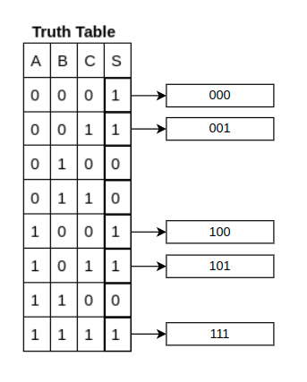
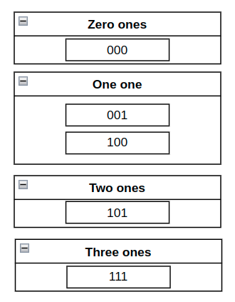
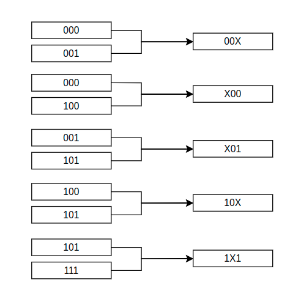
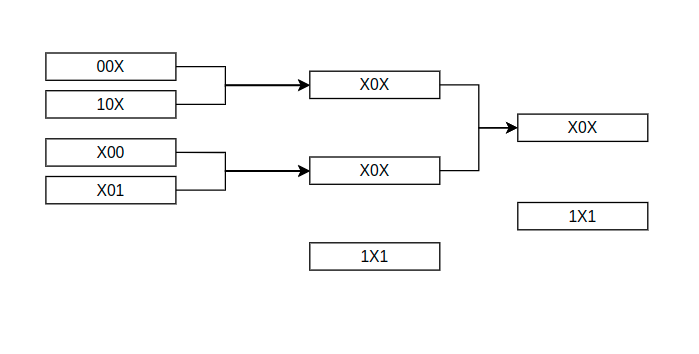

# Quine McCluskey Solver

There are many ways to simplify boolean expression, one of them is using the Quine McCluskey algorithm. 
This is a python implementation of the algorithm.

## Description of the algorithm

The best way to visualize how the algorithm works is by looking at an example.

### Setup
The first step is to find all the combinations of ones and zeroes that result in one.


 
### Grouping similars
Next we group all the combinations by number of ones



### Combine and simplify
Then we make pairs from adjacent groups where there is a one digit difference, and combine them putting an X where the different digit was. 
If there is a term that can't be combined it is carried to the next step.



### Repeat
Repeat the process until its no longer possible to simplify



### Convert Back to Binary Variables
Now you can just write the solution by writing the remaining terms as multiplications (ANDs) and sum them, in this case the solution is: <span style="font-size:larger;"> B̅ + AC</span>  

## Getting Started

There used to be a website where you where able to use the program, but the server is no longer running, so to use the program you have to install python and clone the repository to your machine and run either the [script_input.py](script_input.py) file or the [terminal_input.py](terminal_input.py) file.

### Running the script
When you run the script you will be presented with the folowing options

```
First type the number of variables.
Then type an outing or the truth tables ones.
For the outing write in the format '1 0 1 0 1 0 1 0'
For the truth table write in the format '000 001 010'
Input number of variables: 
(If you don't want this kind of input type enter) Input table output : 
(If you don't want this kind of input type enter) Input truth table with in a single line : 
```

The outing format is the S column of the truth table separated by spaces.
And the truth table represents the combinations that result in ones.


## Author

Luc Joffily Ribas
[mail](luc.joffily.ribas@gmail.com)
